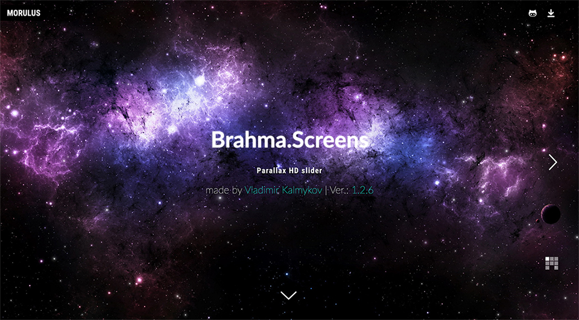
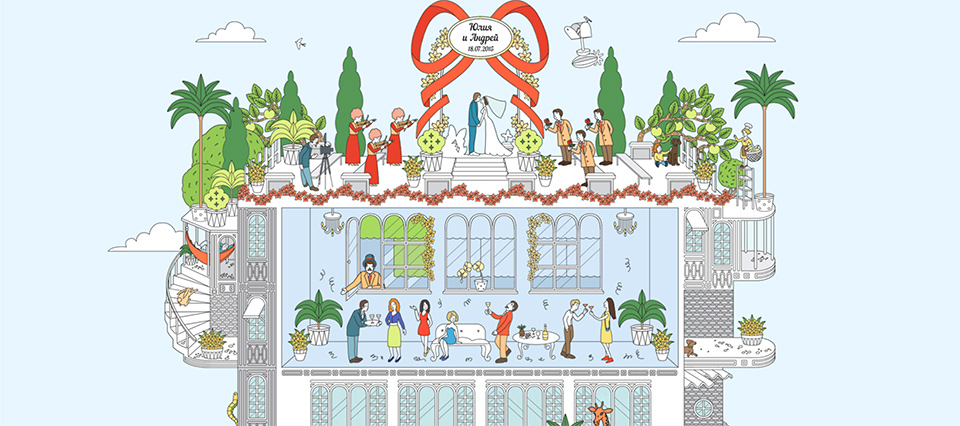

Vladimir Kalmykov
==

Программист, дизайнер, архитектор и инженер программного обеспечения.

[Github](https://github.com/morulus) | [Twitter](https://twitter.com/Morulus) | [Codepen](https://codepen.io/morulus) | [LinkedIn](https://www.linkedin.com/in/vladimirkalmykov/) | [Facebook](https://www.facebook.com/luciusmorulus)

Публикации на Medium
--

[Проволочки при проектировании структуры React приложения](https://medium.com/@vladimirmorulus/%D0%BF%D1%80%D0%BE%D0%B2%D0%BE%D0%BB%D0%BE%D1%87%D0%BA%D0%B8-%D0%BF%D1%80%D0%B8-%D0%BF%D1%80%D0%BE%D0%B5%D0%BA%D1%82%D0%B8%D1%80%D0%BE%D0%B2%D0%B0%D0%BD%D0%B8%D0%B8-%D1%81%D1%82%D1%80%D1%83%D0%BA%D1%82%D1%83%D1%80%D1%8B-react-%D0%BF%D1%80%D0%B8%D0%BB%D0%BE%D0%B6%D0%B5%D0%BD%D0%B8%D1%8F-609f80105e2c)

[React PropTypes в функциональном стиле](https://medium.com/@vladimirmorulus/react-proptypes-%D0%B2-%D1%84%D1%83%D0%BD%D0%BA%D1%86%D0%B8%D0%BE%D0%BD%D0%B0%D0%BB%D1%8C%D0%BD%D0%BE%D0%BC-%D1%81%D1%82%D0%B8%D0%BB%D0%B5-21064b63b65a)

[Динамический инжект кода в redux-saga](https://medium.com/@vladimirmorulus/%D0%B4%D0%B8%D0%BD%D0%B0%D0%BC%D0%B8%D1%87%D0%B5%D1%81%D0%BA%D0%B8%D0%B9-%D0%B8%D0%BD%D0%B6%D0%B5%D0%BA%D1%82-%D0%BA%D0%BE%D0%B4%D0%B0-%D0%B2-redux-saga-cf72e19a2e25?source=your_stories_page)

[Веб-анимация на основе спрайтов](https://medium.com/@vladimirmorulus/%D0%B2%D0%B5%D0%B1-%D0%B0%D0%BD%D0%B8%D0%BC%D0%B0%D1%86%D0%B8%D1%8F-%D0%BD%D0%B0-%D0%BE%D1%81%D0%BD%D0%BE%D0%B2%D0%B5-%D1%81%D0%BF%D1%80%D0%B0%D0%B9%D1%82%D0%BE%D0%B2-8786a9cce59b)

[Как я разрабатывал скрипт анимации перемещения элемента по кривой Безье на Javascript](https://medium.com/@vladimirmorulus/%D0%BF%D0%BE%D0%BD%D0%B8%D0%BC%D0%B0%D0%BD%D0%B8%D0%B5-%D0%BF%D1%80%D0%B8%D0%BD%D1%86%D0%B8%D0%BF%D0%B0-%D1%80%D0%B0%D0%B1%D0%BE%D1%82%D1%8B-%D0%BF%D1%80%D0%BE%D0%BF%D0%BE%D1%80%D1%86%D0%B8%D0%BE%D0%BD%D0%B0%D0%BB%D1%8C%D0%BD%D0%BE%D0%B3%D0%BE-%D0%B1%D0%BB%D0%BE%D0%BA%D0%B0-%D0%B2-html-6198b8612183?source=your_stories_page---------------------------)

[Кастомные атрибуты в React или 5 золотых правил как получить валидность атрибута](https://medium.com/@vladimirmorulus/%D0%BA%D0%B0%D1%81%D1%82%D0%BE%D0%BC%D0%BD%D1%8B%D0%B5-%D0%B0%D1%82%D1%80%D0%B8%D0%B1%D1%83%D1%82%D1%8B-%D0%B2-react-%D0%B8%D0%BB%D0%B8-5-%D0%B7%D0%BE%D0%BB%D0%BE%D1%82%D1%8B%D1%85-%D0%BF%D1%80%D0%B0%D0%B2%D0%B8%D0%BB-%D0%BA%D0%B0%D0%BA-%D0%BF%D0%BE%D0%BB%D1%83%D1%87%D0%B8%D1%82%D1%8C-%D0%B2%D0%B0%D0%BB%D0%B8%D0%B4%D0%BD%D0%BE%D1%81%D1%82%D1%8C-%D0%B0%D1%82%D1%80%D0%B8%D0%B1%D1%83%D1%82%D0%B0-a22fc97be60b)

Видео
--

[Митап по DDD и DDS в Redux приложении в компании Infotech Group](https://www.youtube.com/watch?v=U8ZYaurjWPI)

Публикации на npmjs.org
--

[stringify-object-extract-functions](https://www.npmjs.com/package/stringify-object-extract-functions)

Форк популярного пакета stringify-object. Добавляет возможность извлекать и сериализовывать тела функций, сожержащихся в свойствах сериализуемого объекта.

[redux-store-emitter](https://www.npmjs.com/package/redux-store-emitter)

Обертка вокруг Redux, позволяющая подписываться на его действия как на классические события.

[import-sub](https://www.npmjs.com/package/import-sub)

Вспомогательный инструмент для замены путей по определенным шаблонам.

[webpack-import-sub-plugin](https://www.npmjs.com/package/webpack-import-sub-plugin)

Плагин для webpack, позволяющий динамически подменять пути импорта пакетов.

[postcss-redirect-import](https://www.npmjs.com/package/postcss-redirect-import)

Плагин для postcss, позволяющий динамически подменят пути импорта файлов.

[assign-prop-types](https://www.npmjs.com/package/assign-prop-types)

Вспомогательная функция-ХОК для указания propTypes и defaultProps React компонентам ([Статья про инструмент](https://medium.com/@vladimirmorulus/react-proptypes-%D0%B2-%D1%84%D1%83%D0%BD%D0%BA%D1%86%D0%B8%D0%BE%D0%BD%D0%B0%D0%BB%D1%8C%D0%BD%D0%BE%D0%BC-%D1%81%D1%82%D0%B8%D0%BB%D0%B5-21064b63b65a))

[connect-context](https://www.npmjs.com/package/connect-context)
ХОК, позволяющий производить и принимать React контекст с функциональными компонентами

[recreator](https://www.npmjs.com/package/recreator)

Конструктор объектов с встроенным механизмом DI

[is-not-production](https://www.npmjs.com/package/is-not-production)

Простая утилита, позволяющая убедиться, что process.env.NODE_END не равен production

[sequ](https://www.npmjs.com/package/sequ)

Композиция функций в Javascript через конкатенативную парадигму.

[thens](https://www.npmjs.com/package/thens)

Абстракция над цепочкой промисов с элементами конкатенативной парадигмы

[mark-props](https://www.npmjs.com/package/mark-props)

Инструмент для маркировки объектов с вложенной структурой, позволяющий отследить местоположение объекта или функции внутри этой структуры

[render-react-markdown-loader](https://www.npmjs.com/package/render-react-markdown-loader)

Импортирует markdown как React компонент с возможностью рендеринга блоков кода

[logdock](https://www.npmjs.com/package/logdock)

Инструмент для создания динамического лога в CLI

[cine](https://www.npmjs.com/package/cine)

Небольшая утилита для анимирования символов в CLI

[extraflow](https://www.npmjs.com/package/extraflow)

Инструмент позволяет последовательно выполнять фабрики функций до достижения финального результата в порядке вложенности

[propsflow](https://www.npmjs.com/package/extraflow)

Инструмент позволяет выполнять цепочки трансформаций объекта по принципу, заложенному в пакете [extraflow](https://www.npmjs.com/package/extraflow)

[invoke-loader](https://www.npmjs.com/package/invoke-loader)

Loader для webpack, позволяющий выполнить другой loader, указанный в опциях

[markdown-heading-loader](https://www.npmjs.com/package/markdown-heading-loader)

Loader для webpack, позволяющий загрузить заголовки markdown документа

Loader для webpack, позволяющий загрузить структуру markdown документа

[git-commits-loader](https://www.npmjs.com/package/git-commits-loader)

Loader для webpack, позволяющий загрузить историю git коммитов указанного файла

[complex-loader](https://www.npmjs.com/package/complex-loader)

Loader для webpack, позволющий комбинировать в себе работу нескольких loader'ов одновременно

[sequencex](https://www.npmjs.com/package/sequencex)

Еще одна реализация парадигмы [CSP](https://en.wikipedia.org/wiki/Communicating_sequential_processes) на Javascript

[resource-info-loader](https://www.npmjs.com/package/resource-info-loader)

Loader для webpack, позволяющий получить информацию о файле

[csf](https://www.npmjs.com/package/csf)

Инструмент для создания асинхронных цепочек на базе es6-генераторов

[press-any-key](https://www.npmjs.com/package/press-any-key)

Простая в использовании утилита, позволяющая отследить нажатие любой клавиши в CLI

Утилиты на bash
--

https://github.com/morulus/resolve-up.bash - Утилита для MacOs, написанная на bash, для поиска файлов в старших директориях

Экспериментальные проекты
--

https://github.com/morulus/quart - Хелпер для написания плагинов для Сhrome

https://github.com/morulus/reactive-middleware - Попытка наложить реактивную парадигму на паттерн store

https://github.com/morulus/vendor - Альтернатива RequireJs

https://github.com/morulus/promiseFactory - Конфигурируемый синтетический Promise

Gists
--

Very lite http server
https://gist.github.com/morulus/9cb31a62743814274113ffaa3a49fa8f

Демо
--

### brahma.screens (2015)

Полноэкранный слайдер на jQuery

Демо: http://morulus.github.io/brahma.screens/
Исходник: https://github.com/morulus/brahma.screens

### weddingparty (2016)

Спрайтовая (покадровая) анимация и движение по кривым Безье

Демо: https://morulus.github.io/demo-weddingparty/
Исходник: https://github.com/morulus/demo-weddingparty
Статья: [Как я разрабатывал скрипт анимации перемещения элемента по кривой Безье на Javascript](https://medium.com/@vladimirmorulus/%D0%BF%D0%BE%D0%BD%D0%B8%D0%BC%D0%B0%D0%BD%D0%B8%D0%B5-%D0%BF%D1%80%D0%B8%D0%BD%D1%86%D0%B8%D0%BF%D0%B0-%D1%80%D0%B0%D0%B1%D0%BE%D1%82%D1%8B-%D0%BF%D1%80%D0%BE%D0%BF%D0%BE%D1%80%D1%86%D0%B8%D0%BE%D0%BD%D0%B0%D0%BB%D1%8C%D0%BD%D0%BE%D0%B3%D0%BE-%D0%B1%D0%BB%D0%BE%D0%BA%D0%B0-%D0%B2-html-6198b8612183?source=your_stories_page---------------------------)

### demo-solomki (2014)

Простая казуальная игра на Javascript и SVG

Демо: https://morulus.github.io/demo-solomki/
Исходник: https://github.com/morulus/demo-solomki

### brahma.cartoon (2015)

Демо: https://morulus.github.io/brahma.cartoon/
Исходник: https://github.com/morulus/brahma.cartoon
